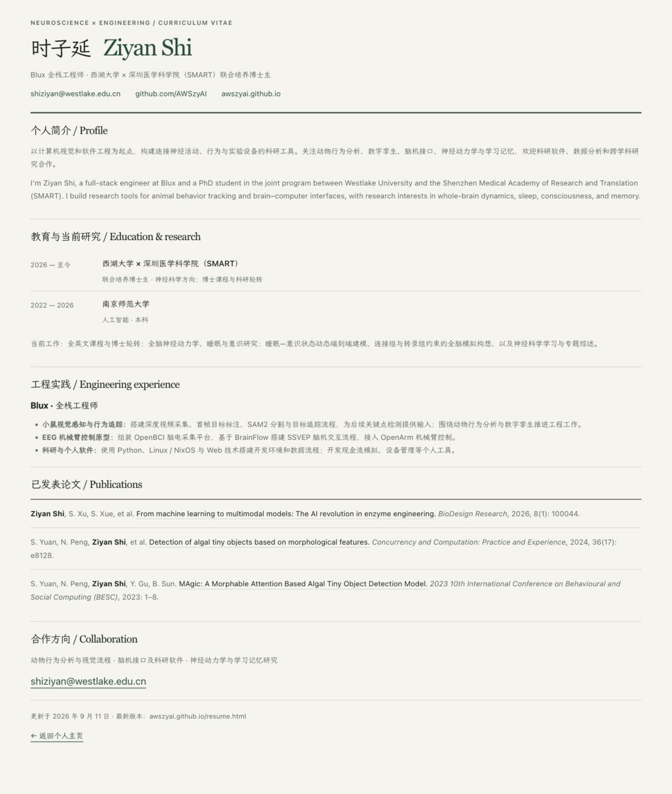

# 时子延的简历

最新更新：2026-09-11

时子延（Ziyan Shi），Blux 全栈工程师，西湖大学与深圳医学科学院（SMART）联合培养博士生。

关注动物行为追踪、数字孪生、脑机接口、神经动力学与学习记忆。

- [查看当前简历](https://awszyai.github.io/resume.html)
- [合作方向与联系方式](https://awszyai.github.io/#collaborate)
- Email: [shiziyan@westlake.edu.cn](mailto:shiziyan@westlake.edu.cn)

